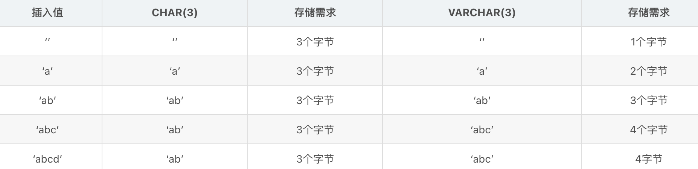

# mySQL 概述

Structure Query Language(结构化查询语言)简称SQL，它被美国国家标准局(ANSI)确定为关系型数据库语言的美国标准，后被国际化标准组织(ISO)采纳为关系数据库语言的国际标准。数据库管理系统可以通过SQL管理数据库；定义和操作数据，维护数据的完整性和安全性。

## SQL的优点

- 简单易学，具有很强的操作性
- 绝大多数重要的数据库管理系统均支持SQL
- 高度非过程化；用SQL操作数据库时大部分的工作由DBMS自动完成

## SQL的分类

- DDL(Data Definition Language) 数据定义语言，用来操作数据库、表、列等； 常用语句：CREATE、 ALTER、DROP
- DML(Data Manipulation Language) 数据操作语言，用来操作数据库中表里的数据；常用语句：INSERT、 UPDATE、 DELETE
- DCL(Data Control Language) 数据控制语言，用来操作访问权限和安全级别； 常用语句：GRANT、DENY
- DQL(Data Query Language) 数据查询语言，用来查询数据 常用语句：SELECT

## 数据库的三大范式

- 第一范式(1NF)是指数据库表的每一列都是不可分割的基本数据线；也就是说：**每列的值具有原子性，不可再分割**。
- 第二范式(2NF)是在第一范式(1NF)的基础上建立起来得，满足第二范式(2NF)必须先满足第一范式(1NF)。如果表是单主键，那么**主键以外的列必须完全依赖于主键**；如果表是复合主键，那么**主键以外的列必须完全依赖于主键，不能仅依赖主键的一部分**。
- 第三范式(3NF)是在第二范式的基础上建立起来的，即满足第三范式必须要先满足第二范式。第三范式(3NF)要求：表中的非主键列必须和主键直接相关而不能间接相关；也就是说：**非主键列之间不能相关依赖**。

## 数据类型

使用MySQL数据库存储数据时，不同的数据类型决定了 MySQL存储数据方式的不同。为此，MySQL数据库提供了多种数据类型，其中包括整数类型、浮点数类型、定点 数类型、日期和时间类型、字符串类型、二进制…等等数据类型。

### 1.整数类型

根据数值取值范围的不同MySQL 中的整数类型可分为5种，分别是TINYINT、SMALUNT、MEDIUMINT、INT和 BIGINT。下图列举了 MySQL不同整数类型所对应的字节大小和取值范围而最常用的为INT类型的

### 2.浮点数类型和定点数类型

在MySQL数据库中使用浮点数和定点数来存储小数。浮点数的类型有两种：单精度浮点数类型（FLOAT)和双精度浮点数类型（DOUBLE)。而定点数类型只有一种即DECIMAL类型。下图列举了 MySQL中浮点数和定点数类型所对应的字节大小及其取值范围：

从上图中可以看出：DECIMAL类型的取值范围与DOUBLE类型相同。但是，请注意：DECIMAL类型的有效取值范围是由M和D决定的。其中，M表示的是数据的长 度，D表示的是小数点后的长度。比如，将数据类型为DECIMAL(6,2)的数据6.5243 插人数据库后显示的结果为6.52

### 3.字符串类型

在MySQL中常用CHAR 和 VARCHAR 表示字符串。两者不同的是：VARCHAR存储可变长度的字符串。

当数据为CHAR(M)类型时，不管插入值的长度是实际是多少它所占用的存储空间都是M个字节；而VARCHAR(M)所对应的数据所占用的字节数为实际长度加1

### 4.文本类型
文本类型用于表示大文本数据，例如，文章内容、评论、详情等，它的类型分为如下4种：

### 5.日期与时间类型
MySQL提供的表示日期和时间的数据类型分别是 ：YEAR、DATE、TIME、DATETIME 和 TIMESTAMP。下图列举了日期和时间数据类型所对应的字节数、取值范围、日期格式以及零值：

- YEAR类型

	YEAR类型用于表示年份，在MySQL中，可以使用以下三种格式指定YEAR类型 的值。
	- 使用4位字符串或数字表示，范围为’1901’—'2155’或1901—2155。例如，输人 ‘2019’或2019插人到数据库中的值均为2019。
	- 使用两位字符串表示，范围为’00’—‘99’。其中，‘00’—'69’范围的值会被转换为 2000—2069范围的YEAR值，‘70’—'99’范围的值会被转换为1970—1999范围的YEAR 值。例如，输人’19’插人到数据库中的值为2019。
	- 使用两位数字表示，范围为1—99。其中，1—69范围的值会被转换为2001— 2069范围的YEAR值，70—99范围的值会被转换为1970—1999范围的YEAR值。例 如，输人19插入到数据库中的值为2019。
	请注意：当使用YEAR类型时，一定要区分’0’和0。因为字符串格式的’0’表示的YEAR值是2000而数字格式的0表示的YEAR值是0000。

- TIME类型

	TIME类型用于表示时间值，它的显示形式一般为HH:MM:SS，其中，HH表示小时， MM表示分,SS表示秒。在MySQL中，可以使用以下3种格式指定TIME类型的值。
	- 以’D HH:MM:SS’字符串格式表示。其中，D表示日可取0—34之间的值, 插人数据时，小时的值等于(DX24+HH)。例如，输入’2 11:30:50’插人数据库中的日期为59:30:50。
	- 以’HHMMSS’字符串格式或者HHMMSS数字格式表示。 例如，输人’115454’或115454,插入数据库中的日期为11:54:54
	- 使用CURRENT_TIME或NOW()输人当前系统时间。

- DATETIME类型

	DATETIME类型用于表示日期和时间，它的显示形式为’YYYY-MM-DD HH: MM:SS’，其中，YYYY表示年，MM表示月，DD表示日，HH表示小时，MM表示分，SS 表示秒。在MySQL中，可以使用以下4种格式指定DATETIME类型的值。
	以’YYYY-MM-DD HH:MM:SS’或者’YYYYMMDDHHMMSS’字符串格式表示的日期和时间，取值范围为’1000-01-01 00:00:00’—‘9999-12-3 23:59:59’。例如，输人’2019-01-22 09:01:23’或 ‘20140122_0_90123’插人数据库中的 DATETIME 值都为 2019-01-22 09:01:23。
	- 以’YY-MM-DD HH:MM:SS’或者’YYMMDDHHMMSS’字符串格式表示的日期和时间，其中YY表示年，取值范围为’00’—‘99’。与DATE类型中的YY相同，‘00’— '69’范围的值会被转换为2000—2069范围的值，‘70’—'99’范围的值会被转换为1970—1999范围的值。
	- 以YYYYMMDDHHMMSS或者YYMMDDHHMMSS数字格式表示的日期 和时间。例如，插入20190122090123或者190122090123,插人数据库中的DATETIME值都 为 2019-01-22 09:01:23。
	- 使用NOW来输人当前系统的日期和时间。

- TIMESTAMP类型

	TIMESTAMP类型用于表示日期和时间，它的显示形式与DATETIME相同但取值范围比DATETIME小。在此，介绍几种TIMESTAMP类型与DATATIME类型不同的形式：
	- 使用CURRENT_TIMESTAMP输人系统当前日期和时间。
	- 输人NULL时系统会输人系统当前日期和时间。
	- 无任何输人时系统会输入系统当前日期和时间。

### 6.二进制类型

在MySQL中常用BLOB存储二进制类型的数据，例如：图片、PDF文档等。BLOB类型分为如下四种：

