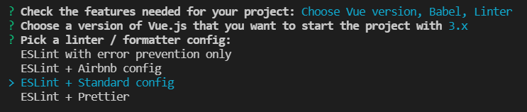
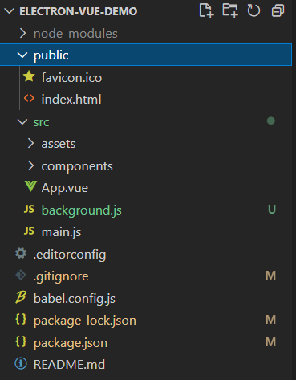

# 项目搭建

## 使用cnpm加速下载或者科学上网
- 这里换淘宝源
    ```
    npm install -g cnpm --registry=https://registry.npm.taobao.org
    # 以后npm直接替换成cnpm使用
    # 我这里选择科学上网，下面都是用的npm
    ```
## 安装/升级vue-cli
- 安装
    ```
    npm install @vue/cli -g
    ```
- 更新
    ```
    # 先查看一下当前版本
    vue -V
    # 如果是vue3
    npm update @vue/cli -g
    #如果是vue3之前的版本，先删掉当前版本再重新下载
    npm uninstall vue-cli -g
    npm install @vue/cli -g
    ```
## 创建vue项目
- 在你工作的目录创建
    ```
    vue create electron-vue-demo
    ```
- 选择自定义安装 

- 选择vue版本 

- 选择vue3.x

- 选择ESLint代码格式检查工具的配置，选择“ESLint + Standard config”，标准配置。

- Line on save表示在保存代码的时候，进行格式检查。
Lint and fix on commit表示在git commit的时候自动纠正格式。
这里只选择“Lint on save”。

- 这里问把 babel, postcss, eslint 这些配置文件放哪？
In dedicated config files 表示独立文件
In package.json 表示放在package.json里
这里选择“In package.json”。

- 是否为以后的项目保留这些设置？选择“N”。

- 等待安装。。。

## 自动安装electron
- 进入项目根目录
    ```
    cd electron-vue-demo
    vue add electron-builder

    # 安装失败大多数是因为网不好
    # 删除node_modules目录
    # 重新多试几次就好了
    ```
- 选择最新版

- 如图所示安装完成

- 这时项目目录应该长这样


## 安装项目依赖
    ```
    npm install

    # 如果报错 : Error: post install error, please remove node_modules before retry
    # 可以忽略！
    ```

# 项目运行

- 输入以下命令，启动开发环境app
    ```
    npm run electron:serve
    ```
- 第一次运行会下载一些插件，需要科学上网才能下载成功，如不能会请求5次后自动跳过，不影响后续
- 运行后


# 配置项目
可跳过
## 配置ESLint代码格式检查工具
- 在项目根目录下创建`.eslintrc.js`
    ```
    vim .eslintrc.js
    ```
- 然后复制粘贴以下代码
    ```
    module.exports = {
        root: true,
        env: {
            node: true
        },
        'extends': [
            'plugin:vue/essential',
            '@vue/standard'
        ],
        rules: {
            'no-debugger': process.env.NODE_ENV === 'production' ? 'error' : 'off',
            // 不检测语句末尾的分号
            'semi': ['off', 'always'],
            // 强制缩进为2个空格
            'indent': ['error', 2],
            // 关闭函数名称跟括号之间的空格检测
            'space-before-function-paren': 0,
            // 忽略大括号内的空格
            'object-curly-spacing': 0
        },
        parserOptions: {
            parser: 'babel-eslint'
        }
    }
    ```

## 配置vue
- 在根目录创建vue.config.js
    ```
    vim vue.config.js
    ```
- 复制粘贴以下代码
    ```
    const path = require('path');

    function resolve (dir) {
        return path.join(__dirname, dir);
    }

    module.exports = {
        publicPath: './',
        devServer: {
            // can be overwritten by process.env.HOST
            host: '0.0.0.0',  
            port: 8080
        },
        chainWebpack: config => {
            config.resolve.alias
                .set('@', resolve('src'))
                .set('src', resolve('src'))
                .set('common', resolve('src/common'))
                .set('components', resolve('src/components'));
        }
    };
    ```
- devServer 用于设置开发环境的服务，这里表示在本地8080端口启动web服务。
- chainWebpack 我们给项目目录起了“别名(alias)”，在代码中，我们可以直接用“别名”访问资源，省去了每次输入完整相对路径的麻烦。

# 项目基本设定
## 主进程和渲染进程简介
在开始下面的步骤之前，很有必要简单了解下Electron的应用架构。

### 主进程
- Electron 运行 package.json 的 main 脚本（background.js）的进程被称为主进程。 在主进程中运行的脚本通过创建web页面来展示用户界面。 一个 Electron 应用总是有且只有一个主进程。

### 渲染进程
- 由于 Electron 使用了 Chromium 来展示 web 页面，所以 Chromium 的多进程架构也被使用到。 每个 Electron 中的 web 页面运行在它自己的渲染进程中。
- 在普通的浏览器中，web页面通常在一个沙盒环境中运行，不被允许去接触原生的资源。 然而 Electron 的用户在 Node.js 的 API 支持下可以在页面中和操作系统进行一些底层交互。

### 主进程和渲染进程的关系
- 主进程使用 BrowserWindow 实例创建页面。 每个 BrowserWindow 实例都在自己的渲染进程里运行页面。 当一个 BrowserWindow 实例被销毁后，相应的渲染进程也会被终止。
- 主进程管理所有的web页面和它们对应的渲染进程。 每个渲染进程都是独立的，它只关心它所运行的 web 页面。
- 具体可参阅官方文档：[skip](https://link.zhihu.com/?target=https%3A//electronjs.org/docs/tutorial/application-architecture%23main-and-renderer-processes)

### app窗口大小
- 修改background.js
    ```
    function createWindow () {
        // Create the browser window.
        win = new BrowserWindow({
            width: 1200,
            height: 620,
            webPreferences: {
                nodeIntegration: true
            }
        })
    }
    ```
### 取消跨域限制
- 修改background.js
    ```
    function createWindow () {
        // Create the browser window.
        win = new BrowserWindow({
            width: 1200,
            height: 620,
            webPreferences: {
                webSecurity: false, // 取消跨域限制
                nodeIntegration: true
            }
        })
    }
    ```
### 取消菜单栏
- 由于macOS的特殊性，顶部菜单栏无法删除，所以我们针对macOS特殊处理，把菜单栏只保留“关于”和“退出”。
- 修改background.js, 增加以下代码
    ##### 注意：`createMenu()`方法在 `createWindow()`里调用
    ```
    import { app, protocol, BrowserWindow, Menu } from 'electron'

    async function createWindow () {
        ...
        createMenu()
    }

    function createMenu() {
    // darwin表示macOS，针对macOS的设置
    if (process.platform === 'darwin') {
        const template = [
        {
            label: 'App Demo',
            submenu: [
            {
                role: 'about'
            },
            {
                role: 'quit'
            }]
        }]
        let menu = Menu.buildFromTemplate(template)
        Menu.setApplicationMenu(menu)
    } else {
        // windows、linux
        Menu.setApplicationMenu(null)
    }
    }
    ```
### 设置app窗口图标
- 准备windows和macOS两版图标
    - windows: app.ico 最小尺寸 256*256
    - macOS: app.png或app.icns 最小尺寸 512*512
    - macOS 版本的要打包之后才能生效
- 把图标文件放到`public`目录下

# 项目打包
这里我们已经集成了electron-builder工具，官方文档可以参阅：[skip](https://www.electron.build/)

## 设置app和安装包图标
- 前面已经准备好了图标，这里直接修改配置文件
- 打开`vue.config.js` ,添加 `pluginOptions`
    ```
    const path = require('path');

    function resolve (dir) {
        return path.join(__dirname, dir);
    }

    module.exports = {
        publicPath: './',
        devServer: {
            // can be overwritten by process.env.HOST
            host: '0.0.0.0',  
            port: 8080
        },
        chainWebpack: config => {
            config.resolve.alias
                .set('@', resolve('src'))
                .set('src', resolve('src'))
                .set('common', resolve('src/common'))
                .set('components', resolve('src/components'));
        }, 
        // 打包配置
        pluginOptions: {
            electronBuilder: {
                builderOptions: {
                    win: {
                        icon: './public/app.ico'
                    },
                    mac: {
                        icon: './public/app.png'
                    },
                    productName: 'AppDemo'
                }
            }
        }
    };
    ```
## 打包
-
    ```
    npm run electron:build
    ```
- 最终在dist_electron目录下生成打包后的产品

# 

