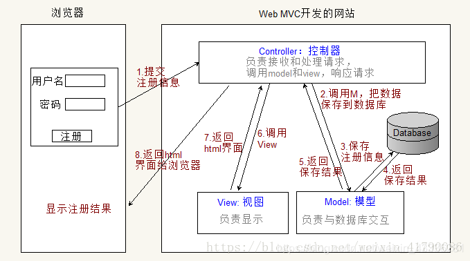
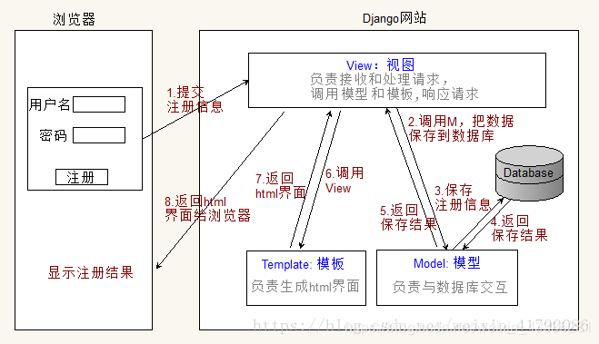
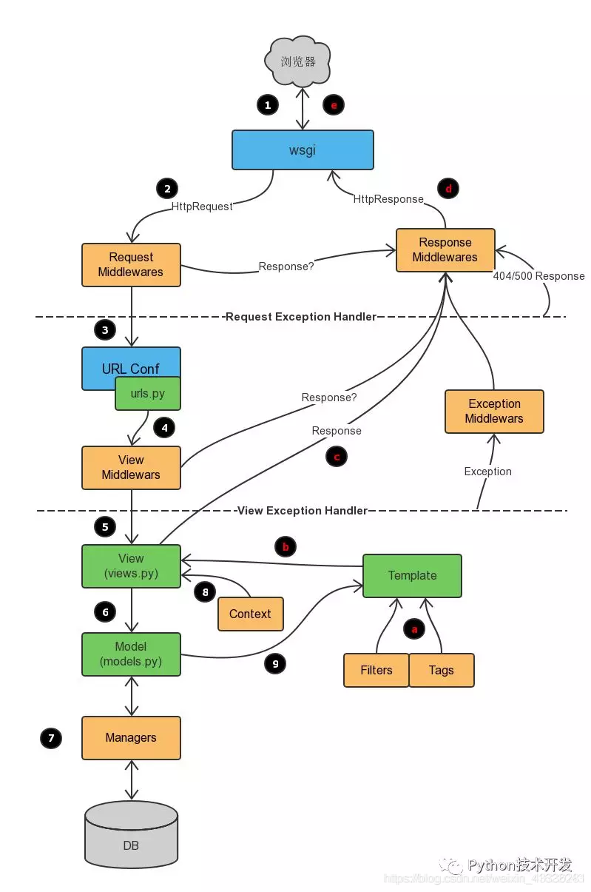

# 简介

Django采用了MTV的软件设计模式，即模型M，视图V和控制器C。

## MVC/MTV

- MVC

	MVC百度百科：全名Model View Controller，是模型(model)－视图(view)－控制器(controller)的缩写，一种软件设计典范，用一种业务逻辑、数据、界面显示分离的方法组织代码，将业务逻辑聚集到一个部件里面，在改进和个性化定制界面及用户交互的同时，不需要重新编写业务逻辑。
	
	通俗解释：一种文件的组织和管理形式！不要被缩写吓到了，这其实就是把不同类型的文件放到不同的目录下的一种方法，然后取了个高大上的名字。当然，它带来的好处有很多，比如前后端分离，松耦合等等，就不详细说明了。

	- 模型(model)：定义数据库相关的内容，一般放在models.py文件中。
	- 视图(view)：定义HTML等静态网页文件相关，也就是那些html、css、js等前端的东西。
	- 控制器(controller)：定义业务逻辑相关，就是你的主要代码。
	

- MTV：

	有些WEB框架觉得MVC的字面意思很别扭，就给它改了一下。view不再是HTML相关，而是主业务逻辑了，相当于控制器。html被放在Templates中，称作模板，于是MVC就变成了MTV。这其实就是一个文字游戏，和MVC本质上是一样的，换了个名字和叫法而已，换汤不换药。
	

## 特点

- 强大的数据库功能：用python的类继承，几行代码就可以拥有一个动态的数据库操作API，如果需要也能执行SQL语句。
- 自带的强大的后台功能：几行代码就让网站拥有一个强大的后台，轻松管理内容。
- 优雅的网址：用正则匹配网址，传递到对应函数。
- 模板系统：强大，易扩展的模板系统，设计简易，代码和样式分开设计，更易管理。
- 缓存系统：与memcached或其它缓存系统联用，表现更出色，加载速度更快。
- 国际化：完全支持多语言应用，允许你定义翻译的字符，轻松翻译成不同国家的语言。


## 目录
- `urls.py`：网址入口，关联到对应的views.py中的一个函数（或generic类），访问网址就对应一个函数。
- `views.py`：处理用户发出的请求，与urls.py对应, 通过渲染templates中的网页可以将显示内容，如登陆后的用户名，用户请求的数据等输出到网页。
- `models.py`：与数据库操作相关，存入或读取数据时用到，用不到数据库时可以不使用。
- `forms.py`：表单，用户在浏览器上输入数据提交，对数据的验证工作以及输入框的生成等工作，也可以不使用。
-  `templates文件夹`：views.py中的函数渲染templates中的html模板，得到动态内容的网页，可以用缓存来提高速度。
- `admin.py`：后台，可以用很少的代码就拥有一个强大的后台。
- `settings.py`：Django 的配置文件，如 DEBUG 的开关，静态文件的位置等。


## 基本命令

- 新建项目
	```
	django-admin.py startproject project-name
	```

- 新建一个APP
	```
	python manage.py startapp app-name #或者
	django-admin.py startapp app-name
	```

- 启动服务器
	```
	python manage.py runserver 0.0.0.0:8000
	python manage.py runserver
	```


## Django请求的生命周期


- 浏览器发起请求
- WSGI创建socket服务端，接收请求（Httprequest）
- 中间件处理请求
- url路由，根据当前请求的URL找到视图函数
- view视图，进行业务处理（ORM处理数据，从数据库取到数据返回给view视图；view视图将数据渲染到template模板；将数据返回）
- 中间件处理响应
- WSGI返回响应（HttpResponse）
- 浏览器渲染

