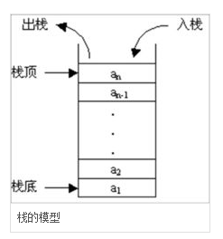

# 数据结构-栈

栈（Stack），也叫做堆栈， 是一种容器， 可存入数据元素、访问元素、删除元素。

只能允许在容器的一端（称为栈顶端指标top）进行加入数据（push）和输出数据（pop）的运算。
没有了位置概念，保证任何时候可以访问、删除的元素都是此前最后存入的那个元素，确定了一种默认的访问顺序。

由于栈数据结构只允许在一端进行操作，因而按照后进先出（LIFO, Last In First Out）的原理运作。
（注意区分：队列是先进先出FIFO）

栈的模型图如下所示：

