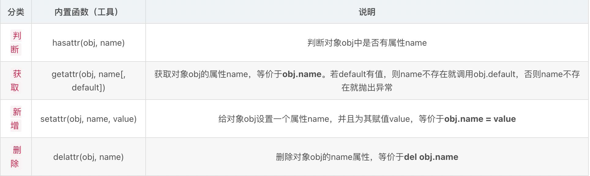
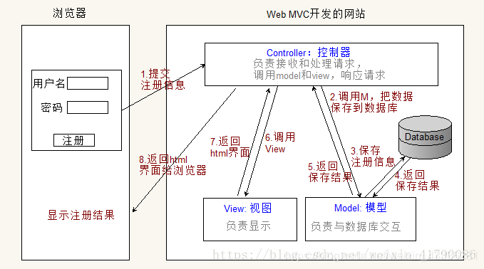
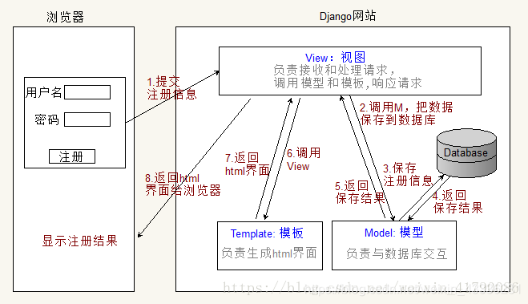
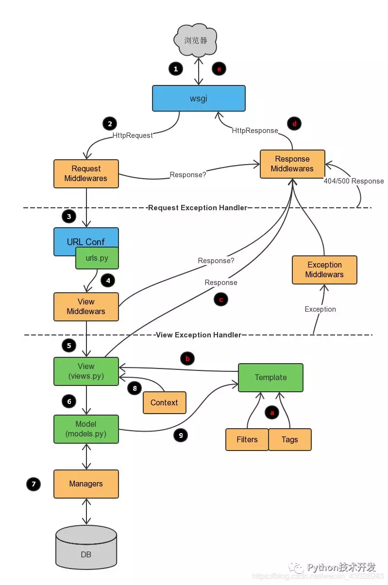

# python

- python的基础`数据类型`有哪些？
	```
	int float str bool list dict tuple set

	可变类型：就是这个数据类型的值在不改变这一块内存空间，而去改变这个数据类型的值
	list dict set
	```

- `字典`底层是怎么实现的?
	```
	字典是通过哈希表实现的。字典也被称为关联数组，还称为哈希数组等。
	
	也就是说，字典也是一个数组，但数组的索引是键经过哈希函数处理后得到的散列值。
	
	哈希函数的目的是使键均匀地分布在数组中，并且可以在内存中以O(1)的时间复杂度进行寻址，从而实现快速查找和修改。
	```

- `字典`的键不能是哪种数据类型
	```
	字典的键必须是不可变的，list、dict、set和内部至少带有上述三种类型之一的tuple都不能作为键
	```

- `列表`和`元组`的区别
	```
	1. 元组是不可变类型，列表是可变类型；
	2. 元组是静态的，长度大小是固定的，列表反之；
	3. 列表比元组慢； # 原因是他们的储存方式不同，相同的数据，list所需空间要比元组大，因为list是动态的，需要一个空间来存指针，还需要一个空间来存列表长度；
	```

- 如何在Python中`管理内存`？
	```
	python中的内存管理由Python私有堆空间管理。所有Python对象和数据结构都位于私有堆中。程序员无权访问此私有堆。python解释器负责处理这个问题。

	Python对象的堆空间分配由Python的内存管理器完成。核心API提供了一些程序员编写代码的工具。

	Python还有一个内置的垃圾收集器，它可以回收所有未使用的内存，并使其可用于堆空间。
	```

- python中`垃圾回收机制`？
	- 引用计数:（主）

	    在Python中每一个对象的核心就是一个结构体，它的内部有一个引用计数器（ob_refcnt）。程序在运行的过程中会实时的更新计数器的值，来反映引用当前对象的名称数量。当某对象的引用计数值为0,那么它的内存就会被立即释放掉。
		- 引用计数 +1:
			- 对象被创建，例如a=2
			- 对象被引用，b=a
			- 对象被作为参数，传入到一个函数中
			- 对象作为一个元素，存储在容器中
		- 引用计数 -1:
			- 对象别名被显示销毁 del
			- 对象别名被赋予新的对象
			- 一个对象离开他的作用域
			- 对象所在的容器被销毁或者是从容器中删除对象
	- 标记清除:

		Python采用了“标记-清除”(Mark and Sweep)算法，解决容器对象可能产生的循环引用问题。(注意，只有容器对象才会产生循环引用的情况，比如列表、字典、用户自定义类的对象、元组等。而像数字，字符串这类简单类型不会出现循环引用。作为一种优化策略，对于只包含简单类型的元组也不在标记清除算法的考虑之列)
		- 标记阶段，遍历所有的对象，如果是可达的（reachable），也就是还有对象引用它，那么就标记该对象为可达；
		- 清除阶段，再次遍历对象，如果发现某个对象没有标记为可达，则就将其回收。

	- 分代回收：

		在循环引用对象的回收中，整个应用程序会被暂停，为了减少应用程序暂停的时间，Python 通过“分代回收”(Generational Collection)以空间换时间的方法提高垃圾回收效率。

		分代回收是基于这样的一个统计事实 ：对于程序，存在一定比例的内存块的生存周期比较短；而剩下的内存块，生存周期会比较长，甚至会从程序开始一直持续到程序结束。生存期较短对象的比例通常在 80%～90% 之间，这种思想简单点说就是：对象存在时间越长，越可能不是垃圾，应该越少去收集。这样在执行标记-清除算法时可以有效减小遍历的对象数，从而提高垃圾回收的速度。

- python中`反射`

	反射是一个非常重要的概念，它是一种字符串与对象的映射关系，利用字符串去操作对象，可以对操作的对象进行成员的查找、获取、添加以及删除。通俗地说，反射是一种基于字符串的事件驱动，使用字符串就可以获取对象中的属性或方法（方法的内存地址，加西文圆括号()与对应传参，即可执行），也可以添加或删除对象中的属性或方法
	

- python`生成器、迭代器`

	迭代器 是一种支持next()操作的对象。它包含了一组元素，当执行next()操作时，返回其中一个元素，然后还有iter方法返回自己本身。对于string、list、dict、tuple等这类容器对象，使用for循环遍历是很方便的。在后台for语句对容器对象调用iter()函数，iter()是python的内置函数。iter()会返回一个定义了next()方法的迭代器对象，它在容器中逐个访问容器内元素，next()也是python的内置函数。在没有后续元素时，next()会抛出一个StopIteration异常

	生成器 是创建迭代器的一个工具。它写起来就像是正规的函数，只是在需要返回数据的时候使用yield语句。每次next()被调用时，生成器会返回它脱离的位置（它记忆语句最后一次执行的位置和所有的数据值）

	区别：生成器能做到迭代器能做的所有事,而且因为自动创建了__iter__()和next()方法,生成器显得特别简洁,而且生成器也是高效的，使用生成器表达式取代列表解析可以同时节省内存。除了创建和保存程序状态的自动方法,当发生器终结时,还会自动抛出StopIteration异常


# Django

## 简述 Django项目的组成模块

- `Project`:工程是承载了 Django实例的所有设置的 Python程序包。
	
	大部分情况下,—个web站点就是一个工程。工程内可以新建及存放该工程固有的应用,或者保存Web站点的设置(数据库设置、 Django 的选项设置、各应用的设置等)

- `Apps`:对于 Django而言,应用之的是表示单一工程的Web应用的 Python程序包。

	由于其本质就是 Python程序包,因此方法 PYTHONPATH有效地任何位置都没有问题。这里最好尽量减少应用与工程、应用于应用之间的 依赖关系,做到功能独立,以便在其他工程中重复利用。

- `Model`: Django提供了O尺R映射工具,因此可以用 Python代码来描述数据库布局。
	
	每个模型都是继承了 django. db. models.Mode类的 Python的类,分别对应数据库中的一个表格。通过建数据库的字段、关系、行为定义为模型类的属性或方法,我们可以使用丰富且灵活的数据库方位API。

- `URL Route`:URL分配器机制使得∪RL信息不再受框架及扩展名的制约,从而让Web应用的URL设计保持简介。

	∪R在 URIconf模块中进行描述,∪ RLconf模块中包含使用正则表达式书写的∪RL和 Python函数的映像。∪ RIconfi能够以应用为单位进行分割,因此提高了应用的可重复利用性。另外,我们可以利用给∪RL设置名称并定义的方式让代码和目标直接通过该名称调用URL,从而将URL设计与代码分离。
- `view`:Django的视图时一类函数,它能够生成指定页面的Httpresponse对象或Htto404这样的异常情况,返回HTTP请求。

	典型的视图函数的处理流程通常是从请求参数中获取数据,读取模型,热按后根据获取的数据渲染模板。

- `DTL`:在Django的概念中,模板系统只负责显示,并不是编写逻辑代码的环境。

	因此 Django的模板系统将设计与內容、代码分离开来，是一个功能强、扩展性高、对设计者很友好的模板语言。

	模板基于文本而不是XML,因此它不但能生成XML和HTML,还能生成E-mal、 JavaScript、CSV等任意文本格式。

	另外,如果使用模板继承玏能,子模板只需要将◇模板中预留的空位填满即可。我们在编写模板时只需要描述各ˆ模板独有的部分,因此 可以省去重复冗余的编码过程。

- `Admin`:大多Web应用在运行过程中,都需要—个专供拥有管理员权限的用户添加、编辑、删除数据的界面,但是实际制作这个界面并不 容易。
	
	django只需将已经皃工的模型添加到管理站点,就能根据模型定义,动态地生成页面。为我们提供一个功能齐全的管理界面。

- `Cache System`: Django可以使用 memcached等缓存后端轻松地缓存数据。
	
	比如可以将动态页面的渲染结果缓存下来,等到下次需要时直接读取缓存,从而不必每次都对动态页面进行处理。

	缓存的后端可以从 memcached、数据库、文件系统、本地內存等位置进行选择。缓存对象也攴持整ˆ网站、特定的整个视图、部分模 板、特定数据等。


## MVC/MTV

- MVC

	MVC百度百科：全名Model View Controller，是模型(model)－视图(view)－控制器(controller)的缩写，一种软件设计典范，用一种业务逻辑、数据、界面显示分离的方法组织代码，将业务逻辑聚集到一个部件里面，在改进和个性化定制界面及用户交互的同时，不需要重新编写业务逻辑。
	
	通俗解释：一种文件的组织和管理形式！不要被缩写吓到了，这其实就是把不同类型的文件放到不同的目录下的一种方法，然后取了个高大上的名字。当然，它带来的好处有很多，比如前后端分离，松耦合等等，就不详细说明了。

	- 模型(model)：定义数据库相关的内容，一般放在models.py文件中。
	- 视图(view)：定义HTML等静态网页文件相关，也就是那些html、css、js等前端的东西。
	- 控制器(controller)：定义业务逻辑相关，就是你的主要代码。
	

- MTV：

	有些WEB框架觉得MVC的字面意思很别扭，就给它改了一下。view不再是HTML相关，而是主业务逻辑了，相当于控制器。html被放在Templates中，称作模板，于是MVC就变成了MTV。这其实就是一个文字游戏，和MVC本质上是一样的，换了个名字和叫法而已，换汤不换药。
	


## Django请求的生命周期


- 浏览器发起请求
- WSGI创建socket服务端，接收请求（Httprequest）
- 中间件处理请求
- url路由，根据当前请求的URL找到视图函数
- view视图，进行业务处理（ORM处理数据，从数据库取到数据返回给view视图；view视图将数据渲染到template模板；将数据返回）
- 中间件处理响应
- WSGI返回响应（HttpResponse）
- 浏览器渲染


## Django有哪些中间件

