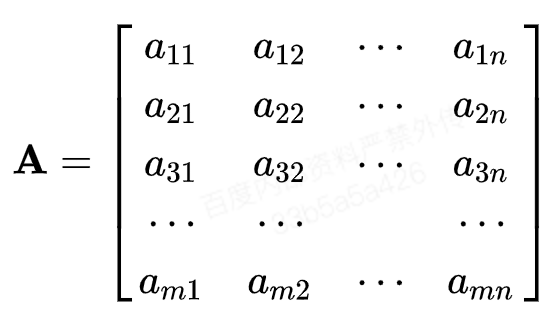
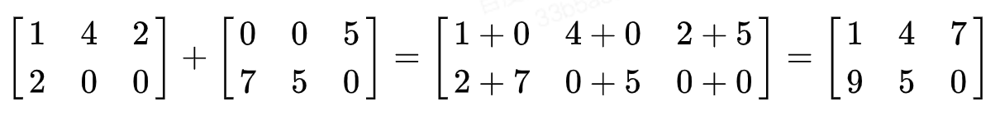
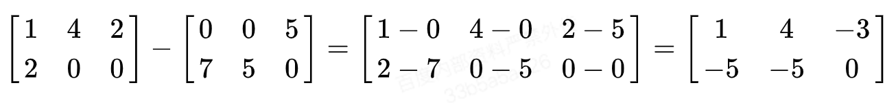
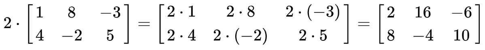
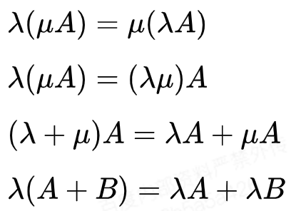
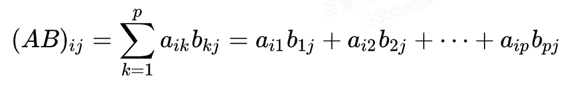

# 线性代数：矩阵与向量

## 矩阵

- 矩阵的定义：

    由 m × n 个数aij排成的m行n列的数表称为m行n列的矩阵，简称m × n矩阵。记作：

    

    这m×n 个数称为矩阵A的元素，简称为元，数aij位于矩阵A的第i行第j列，称为矩阵A的(i,j)元，以数 aij为(i,j)元的矩阵可记为(aij)或(aij)m × n，m×n矩阵A也记作Amn。

- 基本运算

    - 加法

        **示例：**

        

        矩阵的加法满足下列运算律(A，B，C都是同型矩阵)：

            A + B = B + A
            
            (A + B) + C = A + (B + C)

        应该注意的是只有同型矩阵之间才可以进行加法
    
    - 减法

        **示例：**

        

    - 数乘

        **示例：**

        

        **矩阵的数乘满足以下运算律：**

        

        矩阵的加减法和矩阵的数乘合称矩阵的线性运算

    - 转置

        把矩阵A的行和列互相交换所产生的矩阵称为A的转置矩阵，这一过程称为矩阵的转置：

    - 乘法

        设A为`m * p`的矩阵，B为`p * n`的矩阵，那么称`m * n`的矩阵C为矩阵A与B的乘积，记作`C = AB`，其中矩阵C中的第 i 行第 j 列元素可以表示为：

        

        **注意事项：**
    
        - 当矩阵A的列数（column）等于矩阵B的行数（row）时，A与B可以相乘。

        - 矩阵C的行数等于矩阵A的行数，C的列数等于B的列数。

        - 乘积C的第m行第n列的元素等于矩阵A的第m行的元素与矩阵B的第n列对应元素乘积之和。

        **基本性质：**
        - 乘法结合律： (AB)C=A(BC）
        - 乘法左分配律：(A+B)C=AC+BC
        - 乘法右分配律：C(A+B)=CA+CB
        - 对数乘的结合性k(AB）=(kA)B=A(kB）
        - 转置 (AB)T=BTAT
        - 矩阵乘法在以下两种情况下满足交换律。
            - AA*=A*A，A和伴随矩阵相乘满足交换律。
            - AE=EA，A和单位矩阵或数量矩阵满足交换律。

## 向量

- **向量的定义**

    在数学中，向量（也称为欧几里得向量、几何向量、矢量），指具有大小（magnitude）和方向的量。它可以形象化地表示为带箭头的线段。箭头所指：代表向量的方向；线段长度：代表向量的大小。与向量对应的量叫做数量（物理学中称标量），数量（或标量）只有大小，没有方向。

    **向量的代数表示：**

    一般印刷用黑体的小写英文字母（a、b、c等）来表示，手写用在a、b、c等字母上加一箭头（→）表示，如 ，也可以用大写字母AB、CD上加一箭头（→）等表示。

    - 二维向量：v = (x1, x2)
    - 三维向量：v = (x1, x2, x3)
    - n维向量：v = (x1, x2, ..., xn)

    **向量的几何表示：**

    向量可以用有向线段来表示。有向线段的长度表示向量的大小，向量的大小，也就是向量的长度。长度为0的向量叫做零向量，记作长度等于1个单位的向量，叫做单位向量。