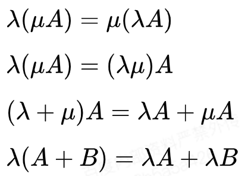

# 线性代数：矩阵与向量

## 矩阵

- 矩阵的定义：

    由 m × n 个数aij排成的m行n列的数表称为m行n列的矩阵，简称m × n矩阵。记作：

    

    这m×n 个数称为矩阵A的元素，简称为元，数aij位于矩阵A的第i行第j列，称为矩阵A的(i,j)元，以数 aij为(i,j)元的矩阵可记为(aij)或(aij)m × n，m×n矩阵A也记作Amn。

- 基本运算

    - 加法

        示例：

        

        矩阵的加法满足下列运算律(A，B，C都是同型矩阵)：

            A + B = B + A
            
            (A + B) + C = A + (B + C)

        应该注意的是只有同型矩阵之间才可以进行加法
    
    - 减法

        示例：

        

    - 数乘

        示例：

        

        矩阵的数乘满足以下运算律：

        

        矩阵的加减法和矩阵的数乘合称矩阵的线性运算

