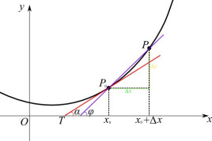
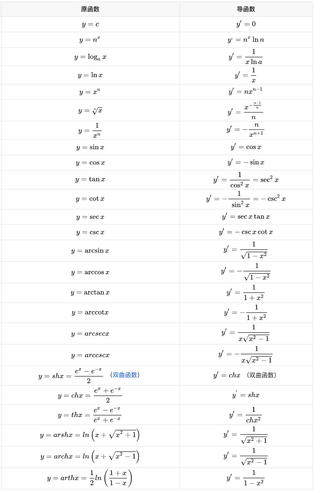
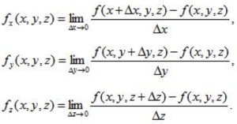

# 高等数学：导数与偏导数

## 倒数的定义

一个函数在x0点的导数表征的是函数在该点的变化率。当函数y=f（x）的自变量x在一点x0上产生一个增量Δx时，函数输出值的增量Δy与自变量增量Δx的比值在Δx趋于0时的极限a如果存在，a即为在x0处的导数，记作f'（x0）或df（x0）/dx。亦即，函数在x0点的导数就是函数在该点的变化率。

或：

常见函数的求导公式如下(表1)：

## 偏导数

一个多变量的函数的偏导数，就是它关于其中一个变量的导数而保持其他变量恒定（相对于全导数，在其中所有变量都允许变化）。

偏导数的极限定义：

根据偏导数定义可知，表1的导数公式同样适用于偏导数。

## 链式法则